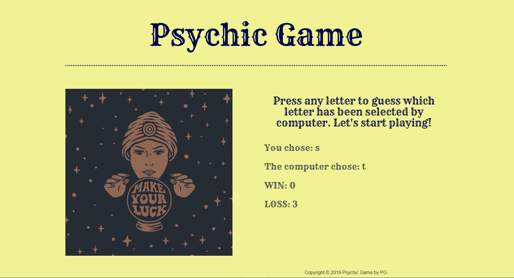

# Psychic-Game
---------------
## Table of Contents
1. [Abstract](#abstract)
2. [Coding Overview](#overview)
3. [Application Display](#display)

## Abstract

The Application is a basic game that computer selects random letters and users try to guess which letter is selected. 

## Coding Overview

The application is built with;
* HTML
* CSS
* Bootstrap
* JavaScript
* jQuery

Application link is : http://www.pinargultekin.com/Psychic-Game/

## Application Display

